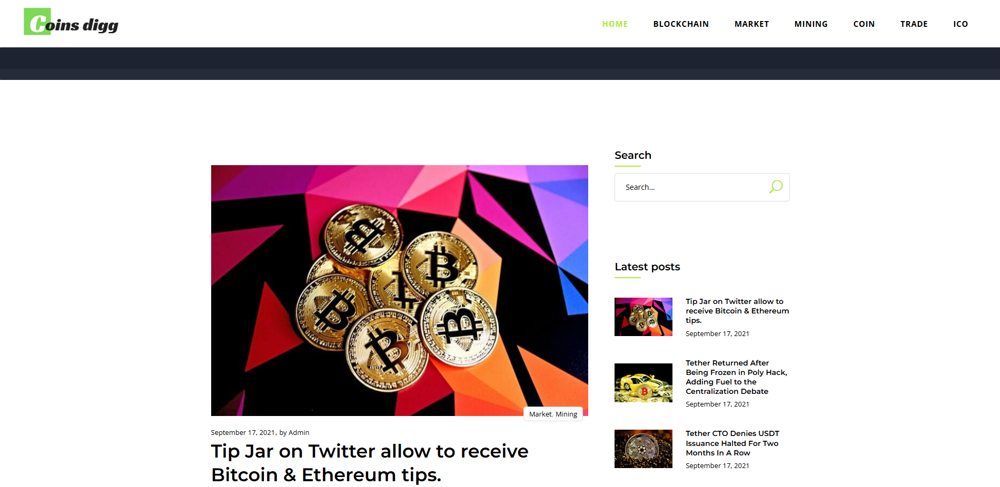

# CoinDigg

- **Client:** Coindigg
- **Industry:** Cryptocurrency & Finance
- **Tech Stack:** PHP, MySQL, WordPress, Elementor, Astra Theme
- **Project Type:** Informative Blog Website
- **Website:** [coinsdigg.smartscriptstech.com](https://coinsdigg.smartscriptstech.com/)

### 🏢 About the Client

Coindigg is an online platform committed to publishing updates, insights, and educational articles about cryptocurrencies. With the crypto universe expanding rapidly, Coindigg aims to deliver precise and easily digestible information for both novice investors and experienced crypto enthusiasts.

### 📚  Overview

Coindigg approached us with the goal of developing a sleek, clean, and fast-loading blog website to share cryptocurrency articles. The objective was to create an **informative and SEO-friendly** website that is easy to manage while keeping the user experience front and center.

### 🧑🏻‍💻 Technology Stack

- **WordPress** – Chosen for its versatility and ease of content management.
- **Elementor** – Used to design responsive and visually appealing layouts.
- **Astra Theme** – A lightweight, performance-optimized theme suited for content-heavy sites.
- **PHP & MySQL** – Used for backend development and dynamic content handling.

###  ✨ Key Features Implemented

- **Clean Blog Structure:** Categorized sections for intuitive navigation across topics.
- **Responsive Design:** Optimized for mobile, tablet, and desktop users.
- **Fast Loading Pages:** Lightweight design and performance tuning for speed.
- **Secure Backend:** Updated plugins and best practices for WordPress hardening.
- **SEO Ready:** Schema markup, optimized meta tags, and clean URLs for better ranking.
- **Easy Content Upload:** Admin panel tailored for effortless blog management.

### 🚧 Challenges

The main challenge was achieving the right balance between design and performance. Given the wide variety of users and devices accessing the site, it was essential to ensure fast load times, seamless navigation, and scalability to accommodate future content growth.

### 📈 Results  

We successfully delivered a modern, intuitive, and high-performance WordPress blog for Coindigg. The final site aligned with the client's vision and provided a solid platform for their growing content needs and digital presence.

### 🙎🏻Client Testimonial

> _"We needed a website that's stylish as well as functional—and the team hit it on the spot. The process was seamless, and the end website really reflects our brand."_  
> — **Coindigg Team**
